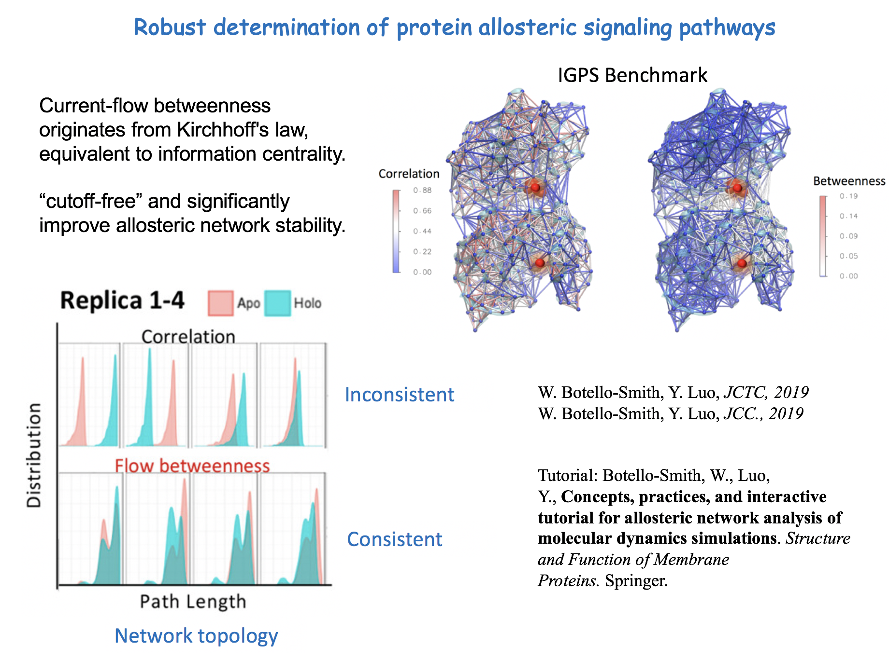

Current-Flow-Allostery
==============================
Documentation Website:https://current-flow-allostery.readthedocs.io/en/latest/

[//]: # (Badges)

Welcome to Current Flow Allostery, this is still a project in development.

Robust Determination of Protein Allosteric Signaling Pathways
=============================================================
Allosteric network from molecular dynamics (MD) simulations is powerful for understanding how protein function changes upon an allosteric perturbation, such as ligand binding and mutation. The main challenge in mapping out the information propagating between amino acids is due to the large fluctuations in protein dynamics that cause instability of the network topology. To solve this problem, we introduce the current-flow betweenness scheme, which originated from electrical network theory. The current-flow betweenness provides a significant improvement in the convergence of the allosteric networks.

https://pubs.acs.org/doi/10.1021/acs.jctc.8b01197

Installation
============
As the current module is still under development and clean up, the best way to get started is to clone the repository to your local computer.

This clones the repository:
        git clone https://github.com/charliewen95/current_flow_allostery.git

Then you have 2 choices:
   1. Create environemnt using
        ./creating_environment.sh
        (This step may take ~10 mins.)
   2. Install the python package using
        pip install -e .
      Note: if the code aboe doesn't work, try
        python -m pip install -e .
   3. Now you can try running the code.

Question/Suggestion?
--------------------
   1. Try to reach Charlie at chenyun.wen@westernu.edu

### Copyright

Copyright (c) 2022, Chen Yun Wen

#### Acknowledgements
 
Project based on the 
[Computational Molecular Science Python Cookiecutter](https://github.com/molssi/cookiecutter-cms) version 1.6.

